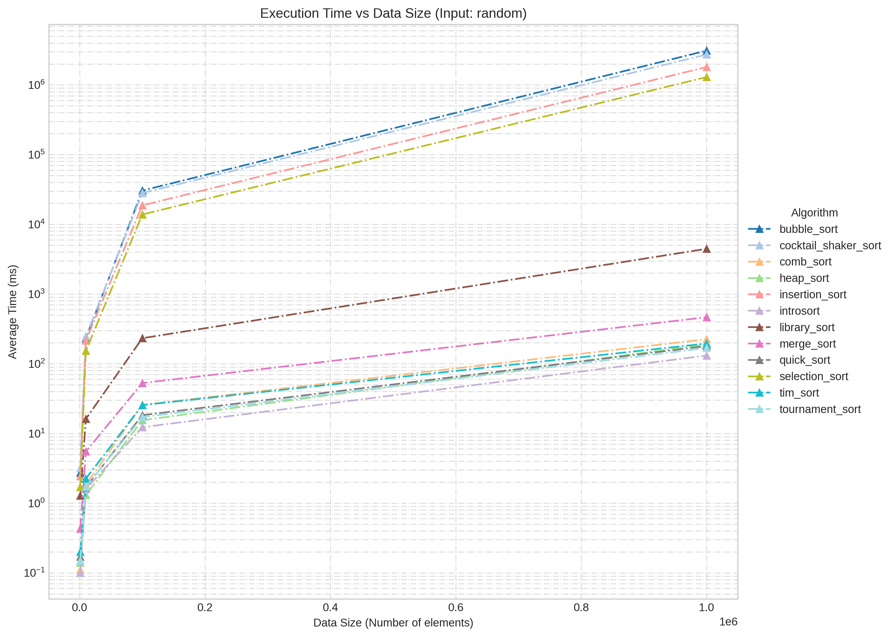
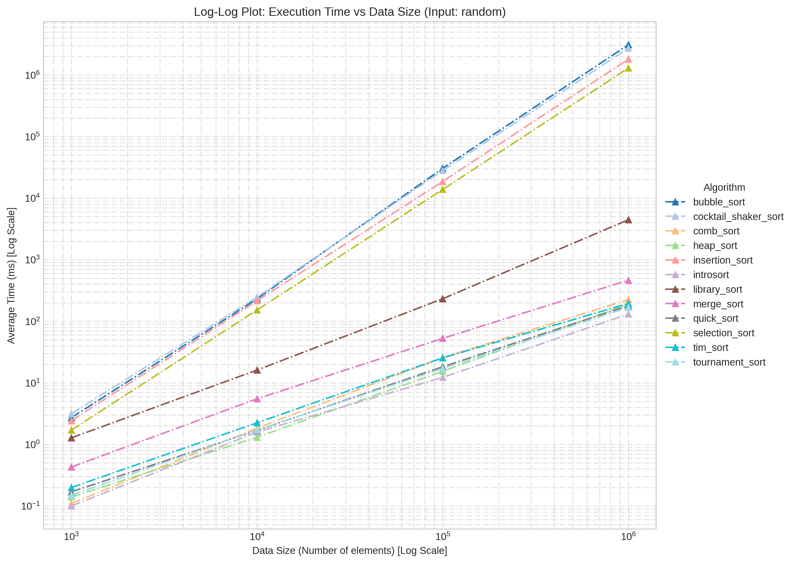
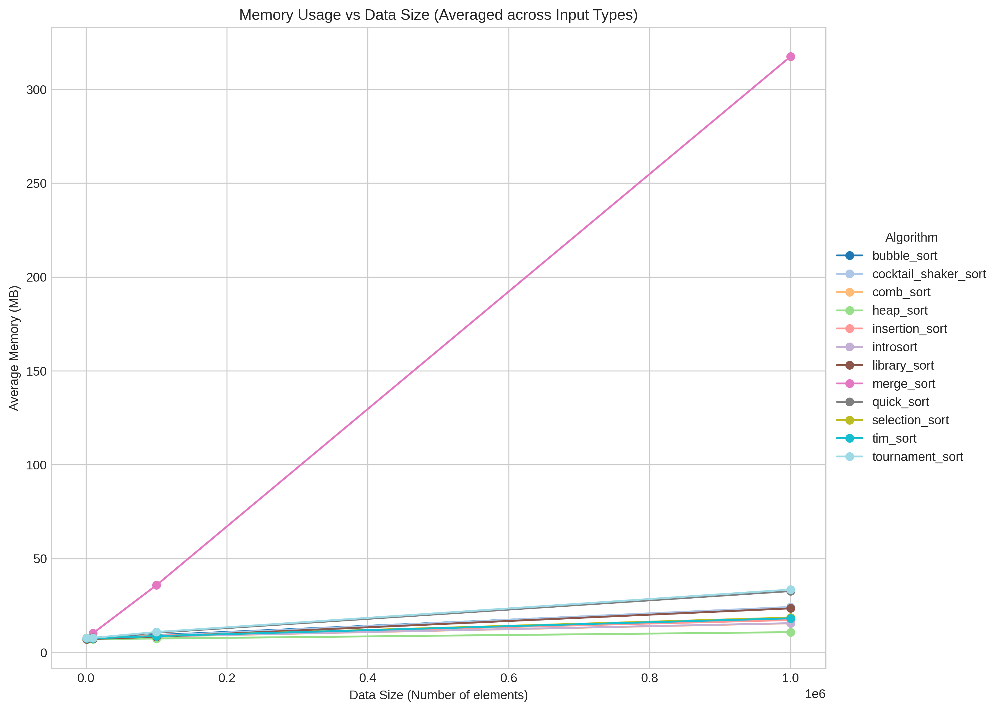

# Assignment 1: Sorting Algorithms Performance Analysis

This assignment involves implementing various sorting algorithms and analyzing their performance (time and memory) across different data distributions and sizes.

## 🚀 Implemented Algorithms
- **$O(n^2)$ Algorithms:** Bubble Sort, Selection Sort, Insertion Sort, Cocktail Shaker Sort.
- **$O(n \log n)$ Algorithms:** Merge Sort, Quick Sort, Heap Sort, Shell Sort, Comb Sort, Tim Sort, Intro Sort.
- **Others:** Library Sort, Tournament Sort.

## 📊 Performance Visualization

### Execution Time (Random Distribution)


### Time Complexity Analysis (Log-Log Plot)


### Memory Usage


## 📁 Directory Structure
- `src/`: Source code (`.cpp`) and `Makefile`.
- `data/`: Input test cases (Random, Ascending, Descending, Partially Random).
- `results/`: Performance data and logs.
- `scripts/`: Data processing and visualization scripts.
- `docs/`: Assignment instructions and templates.
- `images/`: Generated plots.

## ⚙️ How to Run

### 1. Build
Navigate to the `src` directory and use `make` to compile all sorting algorithms and the evaluation tool.
```bash
cd "assignment 1/src"
make
```

### 2. Running the Evaluation Tool (`eval`)
The `eval` tool automates multiple runs and calculates averages.
- **Pre-requisite:** It expects input files to be in the `../data/` directory.
- **Usage:** Edit the `progs` and `input_args` vectors in `src/eval.cpp` to select algorithms and test cases, then run:
```bash
./eval
```
The results will be saved in a new directory named `results_[timestamp]/results.csv`.

### 3. Running Individual Algorithms
You can run any sorting algorithm manually. They read from a file and print the sorted results along with the execution time.
```bash
# Usage: ./[algorithm_name] [input_file_path]
./quick_sort ../data/random-10k.txt
```
*Note: The input file path is relative to the `src` directory.*

### 4. Input Data Types
- `random-*.txt`: Randomly distributed integers.
- `ascending-*.txt`: Already sorted data.
- `descending-*.txt`: Sorted in reverse order.
- `part-random-*.txt`: Partially sorted data.
