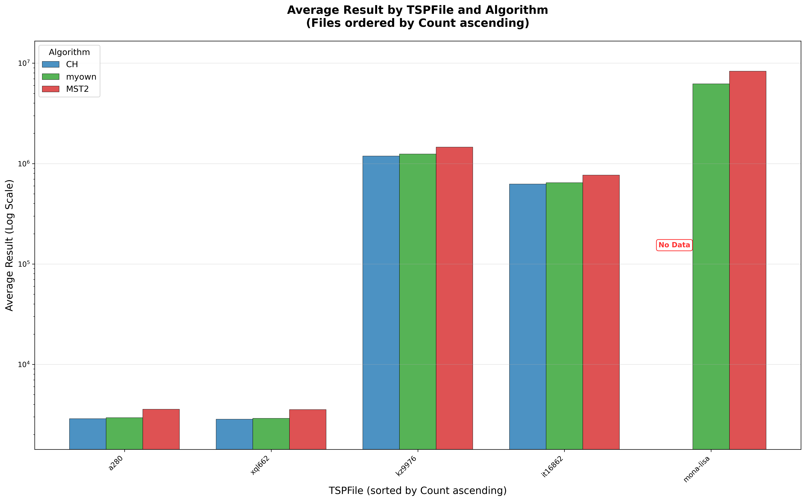
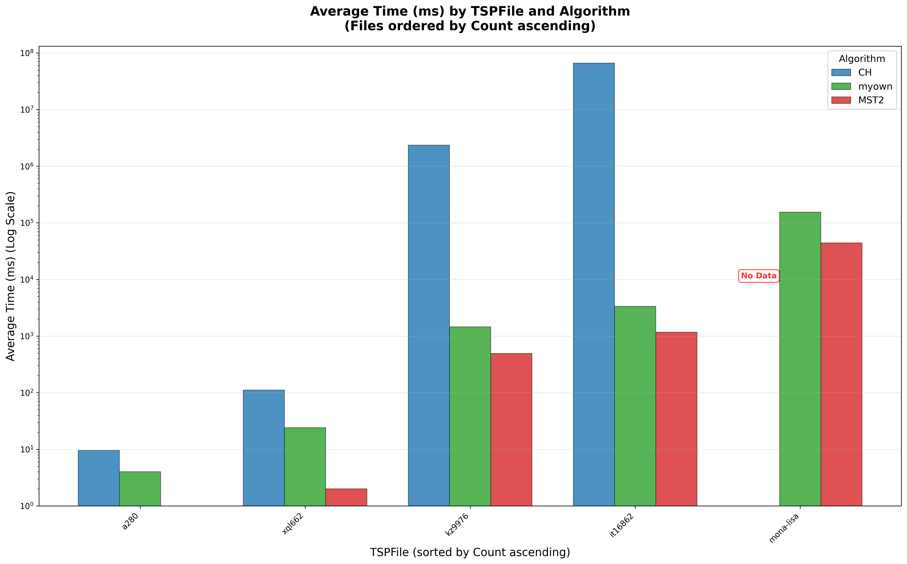
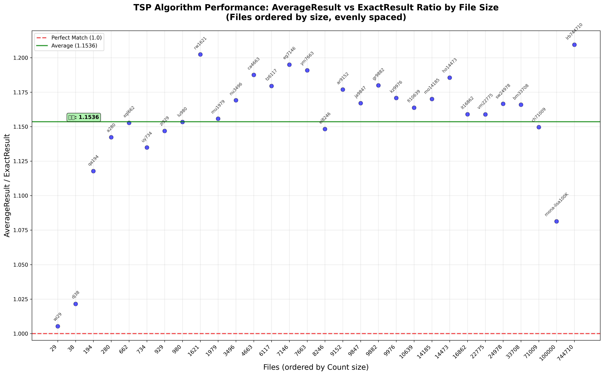

# Assignment 2: Traveling Salesperson Problem (TSP)

Solving the Traveling Salesperson Problem (TSP) using various heuristic and exact algorithms to find the shortest possible route that visits each city exactly once and returns to the origin city.

## 🚀 Implemented Algorithms
- **Basic Heuristics:** Convex Hull (CH), Nearest Neighbor.
- **MST-based:** 2-approximation using Minimum Spanning Tree.
- **Exact Algorithm:** Held-Karp (Dynamic Programming) - limited to small datasets.
- **Custom Approach (MyOwn):** An optimized heuristic designed for high accuracy and efficiency.

## 📊 Performance Visualization

### Approximation Ratio Comparison


### Execution Time Comparison


### Custom Algorithm Performance


## 📁 Directory Structure
- `src/`: Source code (`.cpp`), dependencies (Blossom5), and `Makefile`.
- `data/`: TSP datasets (TSPLIB format).
- `results/`: Output CSVs, memory logs, and generated videos.
- `scripts/`: Video generation and data analysis scripts.
- `docs/`: Assignment instructions and manual.
- `images/`: Generated plots.

## ⚙️ How to Run

### 1. Build
Navigate to the `src` directory and use `make`.
```bash
cd "assignment 2/src"
make
```

### 2. Running the Evaluation Tool (`evaltsp`)
The `evaltsp` tool benchmarks different TSP algorithms against the datasets in `../data/`.
- **Usage:** Configure the `programs` and `tsp_files` vectors in `src/evaltsp.cpp` to choose which algorithms and files to test.
```bash
./evaltsp
```
Results will be generated as a CSV file in the `../results/` directory.

### 3. Running Individual Algorithms
You can execute specific TSP algorithms manually by providing the TSP file path and optional parameters.
```bash
# Usage: ./[algorithm_name] [tsp_file_path] [start_index] [num_nodes]
# Example: Nearest Neighbor on a280.tsp starting from index 0 for all nodes
./myown ../data/a280.tsp 0 280
```
- **Arguments:**
  - `tsp_file_path`: Path to the `.tsp` file (e.g., `../data/a280.tsp`).
  - `start_index`: The starting city index (usually `0`).
  - `num_nodes`: Number of cities to process from the file.
